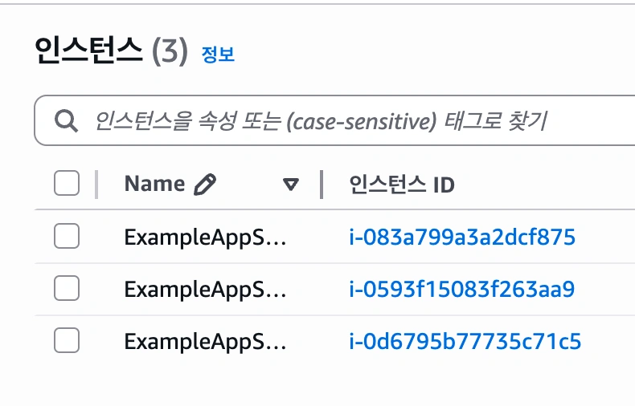

## 주의사항



terraform apply 하는 과정에서 ami를 바꾸면 인스턴스가 아예 새로 뜨게되는데 이때 예전에 띄웠던 인스턴스가 자동으로 삭제되지는 않고 유지됨

```
resource "aws_instance" "app_server" {
  ami           = "ami-08d70e59c07c61a3a"
  instance_type = "t2.micro"

  tags = {
    Name = "ExampleAppServerInstance"
  }
}
```
